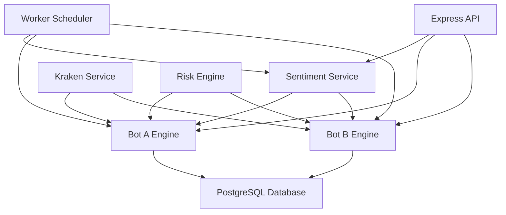

# Charity Bot v1 🤖💝

A sophisticated Node.js + TypeScript backend system that combines automated cryptocurrency trading with charitable donations through a dual-bot architecture and sentiment analysis.

## 🎯 Overview

Charity Bot v1 features two autonomous trading bots working together to generate funds for charitable causes:

- **Bot A (Aggressive Growth)**: Focuses on aggressive trading to grow virtual balance toward cycle targets
- **Bot B (Donation Engine)**: Low-risk trading focused on generating consistent donations
- **Sentiment Analysis**: Real-time Market Confidence Score (MCS) based on Fear & Greed Index and technical analysis
- **Risk Management**: Comprehensive risk assessment and position sizing algorithms

## 🏗️ Architecture



## 🛠️ Tech Stack

- **Runtime**: Node.js 18+
- **Language**: TypeScript
- **Framework**: Express.js
- **Database**: PostgreSQL (Supabase compatible)
- **Trading API**: Kraken REST API
- **Sentiment Data**: Alternative.me Fear & Greed API
- **Scheduling**: node-cron
- **Process Management**: PM2
- **Containerization**: Docker & Docker Compose

## 📁 Project Structure

```
charity-bot-v1/
├── src/
│   ├── bots/
│   │   ├── botAEngine.ts      # Aggressive growth bot
│   │   └── botBEngine.ts      # Low-risk donation bot
│   ├── services/
│   │   ├── krakenService.ts   # Kraken API integration
│   │   ├── sentimentService.ts # Sentiment analysis
│   │   └── riskEngine.ts      # Risk management
│   ├── db/
│   │   ├── schema.sql         # Database schema
│   │   └── db.ts              # Database utilities
│   └── utils/
│       ├── logger.ts          # Logging utilities
│       └── math.ts            # Mathematical functions
├── worker.ts                  # Main worker process
├── docker-compose.yml         # Development environment
├── ecosystem.config.js        # PM2 configuration
└── README.md
```

## 🚀 Quick Start

### 1. Prerequisites

- Node.js 18+
- Docker & Docker Compose
- PostgreSQL (or use Docker)

### 2. Installation

```bash
# Clone the repository
git clone <repository-url>
cd charity-bot-v1

# Install dependencies
npm install

# Copy environment configuration
cp .env.example .env
```

### 3. Database Setup

**Option A: Docker (Recommended for Development)**
```bash
# Start PostgreSQL and PgAdmin
docker-compose up -d postgres pgadmin

# The database will be automatically initialized with the schema
# Access PgAdmin at http://localhost:5050
# Login: admin@charitybot.local / admin123
```

**Option B: Local PostgreSQL**
```bash
# Create database
createdb charity_bot

# Run migrations
npm run db:migrate
```

### 4. Configuration

Edit `.env` file:

```env
# Database
DB_HOST=localhost
DB_PORT=5432
DB_NAME=charity_bot
DB_USER=postgres
DB_PASSWORD=password

# Kraken API (use mock mode for testing)
USE_MOCK_KRAKEN=true
KRAKEN_API_KEY=your_api_key_here
KRAKEN_API_SECRET=your_api_secret_here
```

### 5. Running the Bot

**Development Mode (Mock Trading):**
```bash
npm run dev
```

**Production Mode (Real Trading):**
```bash
# Build the project
npm run build

# Start with PM2
pm2 start ecosystem.config.js --env production
```

## 🤖 Bot System

### Bot A (Aggressive Growth)

**Purpose**: Rapid balance growth through aggressive trading strategies

**Key Features**:
- Dynamic cycle targets (starts at $200)
- Risk-based position sizing (1-5% per trade)
- EMA200 trend following
- Automatic fund transfer to Bot B upon target achievement

**Trading Logic**:
```typescript
if (MCS >= 0.7) {
  // High confidence: risk 3-5%, max 6 trades/day
  positionSize = balance * 0.05;
  maxTrades = 6;
} else if (MCS >= 0.4) {
  // Medium confidence: risk 1-2%, max 3 trades/day
  positionSize = balance * 0.02;
  maxTrades = 3;
} else {
  // Low confidence: minimal trading
  return; // No trading
}
```

**Cycle System**:
1. Starts with $230 virtual balance
2. Target: $200 (transferred to Bot B) + $30 seed (next cycle)
3. Upon reaching target: $200 → Bot B, $30 → next cycle seed
4. New cycle target: $200 + $30 = $230
5. Cycle number increments

### Bot B (Donation Engine)

**Purpose**: Conservative trading for consistent charitable donations

**Key Features**:
- Very low risk (0.25-1% per trade)
- Maximum 1-2 trades per day
- 50% of monthly profits donated
- Only trades in high-confidence conditions (MCS ≥ 0.5)

**Donation System**:
- Monthly processing (1st of each month)
- Donation = 50% of monthly profits
- Automatic reporting and logging
- Manual withdrawal process (API keys have no withdrawal permissions)

## 📊 Sentiment Analysis

### Market Confidence Score (MCS)

The system calculates a composite score combining:

**Fear & Greed Index (60% weight)**:
- 0-20: Extreme Fear → MCS = 0.1
- 20-40: Fear → MCS = 0.3
- 40-60: Neutral → MCS = 0.6
- 60-80: Greed → MCS = 0.8
- 80-100: Extreme Greed → MCS = 1.0

**Technical Trend (40% weight)**:
- BTC price vs EMA200 (1-hour)
- Above EMA200 by 2%: +0.2 trend bonus
- Below EMA200 by 2%: -0.2 trend penalty
- Clamped to 0-1 range

### Data Sources

- **Fear & Greed Index**: [Alternative.me API](https://api.alternative.me/fng/)
- **Price Data**: Kraken public API (OHLC candles)
- **Update Frequency**: Every 15 minutes

## ⚖️ Risk Management

### Position Sizing

Dynamic position sizing based on:
- Current MCS value
- Bot-specific risk profiles
- Available balance
- Daily loss limits

### Risk Profiles

**Bot A (Aggressive)**:
- Max daily loss: $100
- Max drawdown: 5%
- Max open positions: 3
- Risk per trade: 1-5%

**Bot B (Conservative)**:
- Max daily loss: $50
- Max drawdown: 2%
- Max open positions: 2
- Risk per trade: 0.25-1%

### Stop Loss & Take Profit

**Dynamic Levels**:
- High MCS (≥0.7): 4% stop loss, 8% take profit
- Medium MCS (0.4-0.7): 3% stop loss, 6% take profit
- Low MCS (<0.4): 2% stop loss, 4% take profit

## 📈 API Endpoints

### Monitoring & Status

```bash
# Health check
GET /health

# Detailed status
GET /status

# Response example:
{
  "worker": {
    "status": "running",
    "uptime": 3600000,
    "startTime": "2024-01-01T00:00:00.000Z"
  },
  "botA": {
    "active": true,
    "balance": 245.50,
    "cycle": 2,
    "target": 230.00,
    "progress": 106.7,
    "mcs": 0.65,
    "trading": true
  },
  "botB": {
    "active": true,
    "balance": 420.75,
    "mcs": 0.65,
    "trading": false,
    "todaysTrades": 2,
    "monthlyDonationReady": false
  }
}
```

### Manual Triggers (Development/Testing)

```bash
# Trigger sentiment analysis
POST /trigger/sentiment

# Execute Bot A cycle
POST /trigger/botA

# Execute Bot B cycle
POST /trigger/botB

# Process monthly donations
POST /trigger/monthly
```

## 🖥️ Dashboard

A modern Next.js dashboard for monitoring and visualizing bot performance in real-time.

### Dashboard Features

**🎯 Overview Page** (`/`)
- Bot A & Bot B virtual balances
- Market Confidence Score (MCS)
- Fear & Greed Index value
- Open trades count
- Win rates and daily performance
- Bot A cycle progress visualization

**🤖 Bot A Page** (`/bot-a`)
- Current balance and cycle progress
- Risk mode based on MCS
- Recent trades with detailed history
- Performance statistics
- Cycle target completion status

**💝 Bot B Page** (`/bot-b`)
- Balance and month-to-date P&L
- Estimated next donation amount
- Monthly donation reports
- Conservative strategy details
- Win rate and trading statistics

**📊 Sentiment Page** (`/sentiment`)
- Real-time Fear & Greed Index
- Market Confidence Score visualization
- 30-day sentiment history chart
- Trend analysis and statistics
- Technical indicators

### Dashboard Setup

**Installation:**
```bash
cd dashboard
npm install
cp .env.local.example .env.local
```

**Configuration:**
```env
# Database (can be same as backend)
DB_HOST=localhost
DB_PORT=5432
DB_NAME=charity_bot
DB_USER=postgres
DB_PASSWORD=password

# Dashboard Settings
DEMO_MODE=true
# Set to false to use real data from database
```

**Running the Dashboard:**
```bash
# Development mode
npm run dev
# Dashboard will be available at http://localhost:3001

# Production mode
npm run build
npm start
```

### Dashboard API Endpoints

The dashboard provides REST API endpoints for data access:

```bash
# Overall dashboard state
GET /api/dashboard/state?demo=true

# Bot A specific data
GET /api/dashboard/bot-a?demo=true&limit=10

# Bot B specific data
GET /api/dashboard/bot-b?demo=true&limit=10

# Sentiment analysis data
GET /api/dashboard/sentiment?demo=true&limit=30
```

**Response Examples:**

**State Endpoint:**
```json
{
  "botA_virtual_usd": 245.75,
  "botB_virtual_usd": 420.50,
  "cycle_number": 2,
  "cycle_target": 230.00,
  "mcs": 0.65,
  "fgi": 72,
  "open_trades": 1,
  "botA_today_trades": 3,
  "botB_today_trades": 1,
  "botA_win_rate": 0.67,
  "botB_win_rate": 0.80,
  "botB_mtd_pnl": 45.25,
  "last_updated": "2024-01-01T12:00:00.000Z"
}
```

### Demo Mode

The dashboard includes a comprehensive demo mode for testing without connecting to the backend:

- **Toggle**: Switch between demo and live data using the top-right toggle
- **Mock Data**: Realistic simulated bot performance, trades, and sentiment data
- **Full Functionality**: All dashboard features work identically in demo mode
- **Development**: Perfect for UI/UX testing and demonstrations

### Dashboard Architecture

```
dashboard/
├── app/
│   ├── page.tsx              # Overview page
│   ├── bot-a/page.tsx        # Bot A monitoring
│   ├── bot-b/page.tsx        # Bot B monitoring  
│   ├── sentiment/page.tsx    # Sentiment analysis
│   ├── layout.tsx            # Root layout with navigation
│   └── api/dashboard/        # API routes
│       ├── state/route.ts    # Dashboard state endpoint
│       ├── bot-a/route.ts    # Bot A data endpoint
│       ├── bot-b/route.ts    # Bot B data endpoint
│       └── sentiment/route.ts # Sentiment data endpoint
├── lib/
│   └── db.ts                 # Database utilities
└── components/               # Reusable UI components
```

### Dashboard Features

**🎨 Modern UI**
- Dark theme with TailwindCSS
- Responsive design for all devices
- Clean, minimal interface
- Real-time data updates

**📈 Data Visualization**
- Interactive charts for sentiment history
- Progress bars for cycle completion
- Color-coded performance indicators
- Real-time statistics cards

**⚡ Performance**
- Auto-refresh every 30 seconds
- Efficient API calls with caching
- Optimized for low bandwidth
- Fast loading times

**🔒 Security**
- Optional password protection
- Environment-based configuration
- No sensitive data exposure
- Secure database connections

### Mobile Support

The dashboard is fully responsive and works on:
- Desktop browsers (Chrome, Firefox, Safari, Edge)
- Tablet devices (iPad, Android tablets)
- Mobile phones (iOS Safari, Chrome Mobile)

**Mobile Features:**
- Touch-friendly navigation
- Optimized layouts for small screens
- Collapsible sections
- Swipe gestures for charts

## 🔧 Testing Without Real Money

### Mock Mode

Enable mock mode for safe testing:

```env
USE_MOCK_KRAKEN=true
```

**Features**:
- No real API calls to Kraken
- Simulated price data and market conditions
- Mock order execution and fills
- Virtual balance tracking
- All logging and reporting functions normally

### Testing Workflow

1. **Development Setup**:
   ```bash
   # Start with mock mode
   USE_MOCK_KRAKEN=true npm run dev
   ```

2. **Monitor Activity**:
   ```bash
   # Check logs
   tail -f logs/combined.log
   
   # Monitor API status
   curl http://localhost:3000/status
   ```

3. **Test Specific Components**:
   ```bash
   # Test sentiment analysis
   curl -X POST http://localhost:3000/trigger/sentiment
   
   # Test Bot A
   curl -X POST http://localhost:3000/trigger/botA
   
   # Test Bot B
   curl -X POST http://localhost:3000/trigger/botB
   ```

## 🚀 Production Deployment

### PM2 Deployment

```bash
# Install PM2 globally
npm install -g pm2

# Start in production mode
pm2 start ecosystem.config.js --env production

# Monitor
pm2 monit

# View logs
pm2 logs charity-bot-worker

# Restart
pm2 restart charity-bot-worker

# Stop
pm2 stop charity-bot-worker
```

### Environment Variables

**Production Configuration**:
```env
NODE_ENV=production
USE_MOCK_KRAKEN=false
KRAKEN_API_KEY=your_production_api_key
KRAKEN_API_SECRET=your_production_api_secret
LOG_LEVEL=info
LOG_TO_FILE=true
```

### Kraken API Setup

1. **Create Kraken Account**: [Kraken.com](https://kraken.com)
2. **Generate API Keys**:
   - Go to Settings → API
   - Create new API key
   - **Permissions**: Query Funds, Query Open Orders, Create Orders, Cancel Orders
   - **Important**: DO NOT enable "Withdraw" permissions
3. **Test Connection**:
   ```bash
   curl http://localhost:3000/status | jq '.kraken'
   ```

### Database Setup

**Production PostgreSQL**:
```bash
# Create production database
createdb charity_bot_production

# Run migrations
psql charity_bot_production < src/db/schema.sql
```

**Environment Configuration**:
```env
DB_HOST=your_production_db_host
DB_PORT=5432
DB_NAME=charity_bot_production
DB_USER=your_db_user
DB_PASSWORD=your_secure_password
```

## 📊 Monitoring & Logging

### Log Files

- `logs/error.log` - Error messages only
- `logs/combined.log` - All messages
- `logs/worker-output.log` - Process output
- `logs/worker-error.log` - Process errors

### Key Metrics

Monitor these KPIs:
- **Bot A**: Cycle progress, balance growth, win rate
- **Bot B**: Monthly donations, conservative performance
- **Sentiment**: MCS stability, FGI accuracy
- **System**: Uptime, API response times, error rates

### Health Checks

```bash
# Quick health check
curl http://localhost:3000/health

# Detailed status
curl http://localhost:3000/status | jq .
```

## 🛡️ Security Considerations

### API Key Security
- Store API keys in environment variables only
- Use trade-only keys (no withdrawal permissions)
- Rotate keys regularly
- Monitor API usage for anomalies

### Database Security
- Use strong passwords
- Enable SSL connections in production
- Regular backups
- Access logging

### Network Security
- Use HTTPS in production
- Implement rate limiting
- Firewall configuration
- VPN access for management

## 🔄 Maintenance

### Daily Tasks (Automated)
- Clean old sentiment readings
- Log daily statistics
- Check system health

### Monthly Tasks
- Process donations
- Generate reports
- Performance analysis
- Database optimization

### Manual Maintenance
```bash
# Clean logs
npm run clean:logs

# Backup database
pg_dump charity_bot > backup_$(date +%Y%m%d).sql

# Update dependencies
npm audit fix
npm update
```

## 🐛 Troubleshooting

### Common Issues

**Database Connection Failed**:
```bash
# Check if PostgreSQL is running
docker-compose ps postgres

# Check connection
psql -h localhost -U postgres -d charity_bot
```

**Kraken API Errors**:
```bash
# Verify mock mode
curl http://localhost:3000/status | jq '.kraken.mode'

# Check API key validity
curl -X POST http://localhost:3000/trigger/botA
```

**Bot Not Trading**:
```bash
# Check MCS value
curl http://localhost:3000/status | jq '.botA.mcs'

# Verify bot state
psql -h localhost -U postgres -d charity_bot -c "SELECT * FROM bot_state;"
```

### Debug Mode

Enable debug logging:
```env
LOG_LEVEL=debug
```

Restart with:
```bash
npm run dev
```

## 🤝 Contributing

1. Fork the repository
2. Create a feature branch
3. Make changes with tests
4. Submit a pull request

### Development Guidelines

- Use TypeScript strict mode
- Follow existing code style
- Add logging for new features
- Update documentation
- Test in mock mode first

## 📄 License

MIT License - see LICENSE file for details

## 📞 Support

For issues and questions:
1. Check the troubleshooting section
2. Search existing issues
3. Create a new issue with logs and configuration

---

**⚠️ Important Disclaimer**: This software is for educational and research purposes. Cryptocurrency trading involves significant risk. The authors are not responsible for any financial losses incurred through the use of this software. Always test thoroughly with mock modes before using real funds.

**🔒 Security**: Never share your API keys or commit them to version control. Use environment variables and secure storage solutions.